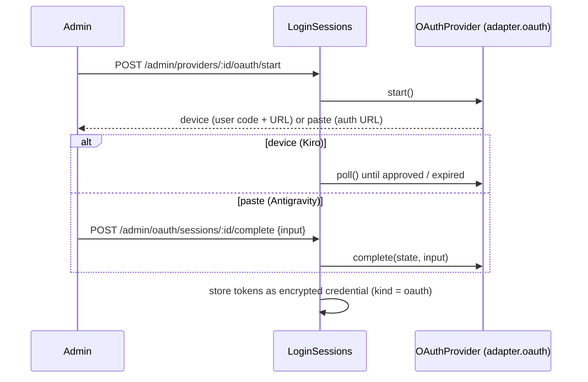

# Provider adapters and credentials

## Adapter contract

`providers/adapter.ts` defines `ProviderAdapter`; `ADAPTERS` maps a provider `type` to its adapter. An adapter turns the canonical OpenAI chat-completions request (`UpstreamCall.body`, model already rewritten) into one upstream call and returns a `Response` in OpenAI shape: JSON when `stream` is false, SSE (usage in the final chunk) when true. Non-2xx upstream responses are returned as-is so the gateway can classify them; only transport errors throw. `providers/chunks.ts` builds/aggregates the OpenAI chunk shape.

| `type`          | Adapter                      | Credential                 | Models                          | Origin                 |
| --------------- | ---------------------------- | -------------------------- | ------------------------------- | ---------------------- |
| `openai-compat` | `providers/openai-compat.ts` | API key (Bearer)           | fetched `GET {base_url}/models` | original               |
| `anthropic`     | `providers/anthropic.ts`     | API key (`x-api-key`)      | fetched, paginated              | adapted from opencodex |
| `antigravity`   | `providers/antigravity/`     | Google OAuth (paste flow)  | static list                     | adapted from opencodex |
| `kiro`          | `providers/kiro/`            | AWS SSO OIDC (device flow) | static list                     | adapted from opencodex |

The adapted adapters keep opencodex's wire knowledge but target this repo's chat-completions interface; see [../project-pdr/opencodex-origin.md](../project-pdr/opencodex-origin.md) for what was ported and what was not.

Optional adapter members: `oauth` (enables login + refresh), `staticModels` (wins over `listModels`), `defaultBaseUrl` (null = `base_url` mandatory).

## Registry and pool

- `Registry` (`registry.ts`): in-memory snapshot of providers, credentials (decrypted) and aliases from SQLite. Admin writes call `reload()`; selector instances survive a reload while the strategy is unchanged.
- `CredentialPool` (`pool/pool.ts`): picks a credential per request and holds in-memory health: in-flight count, cooldown with backoff (429: 30 s–10 min, 5xx: 5 s–5 min, 403: 5 min–1 h, or `Retry-After`), per-credential rpm window, sticky sessions (max 10 000). Returns a `Lease` (`ok`, `fail`, `release`).
- Strategies (`pool/selectors.ts`): `round_robin`, `weighted`, `least_inflight`, `least_used`, `fill_first`, `random`; credentials are also filtered by `models` globs, `priority` and `enabled`/`status`.
- `markDead` persists a terminal failure so a credential stays out of rotation across restarts.

## OAuth accounts

- `LoginSessions` keeps pending logins in memory only; a restart drops unfinished ones.
- `TokenManager` refreshes shortly before expiry, shares one refresh among concurrent callers (refresh tokens are often single-use), and persists the result encrypted via `Registry.saveTokens`.
- `OAuthRefreshError.terminal` retires the account until it signs in again; anything else only cools it down.
- Provider-specific fields that must survive refreshes (project id, profile ARN, regions, client registration) live in `OAuthTokens.extra`.

## Secrets at rest

`crypto.ts` `SecretBox` (AES-256-GCM, key = `MASTER_KEY`) seals credentials via `credentials.ts` (`sealAuth`/`openAuth`). Virtual keys store only a SHA-256 hash plus a display prefix.

## Model catalog

`ModelCatalog` (`models.ts`) stores each provider's model list in `provider_models` / `provider_model_sync`: fetched on first view, on `POST …/models/refresh`, at startup and every `MODEL_SYNC_INTERVAL_HOURS`. A failed refresh keeps the previous list. OAuth providers copy the adapter's static list. Any id works as `provider/<id>` whether or not listed.
