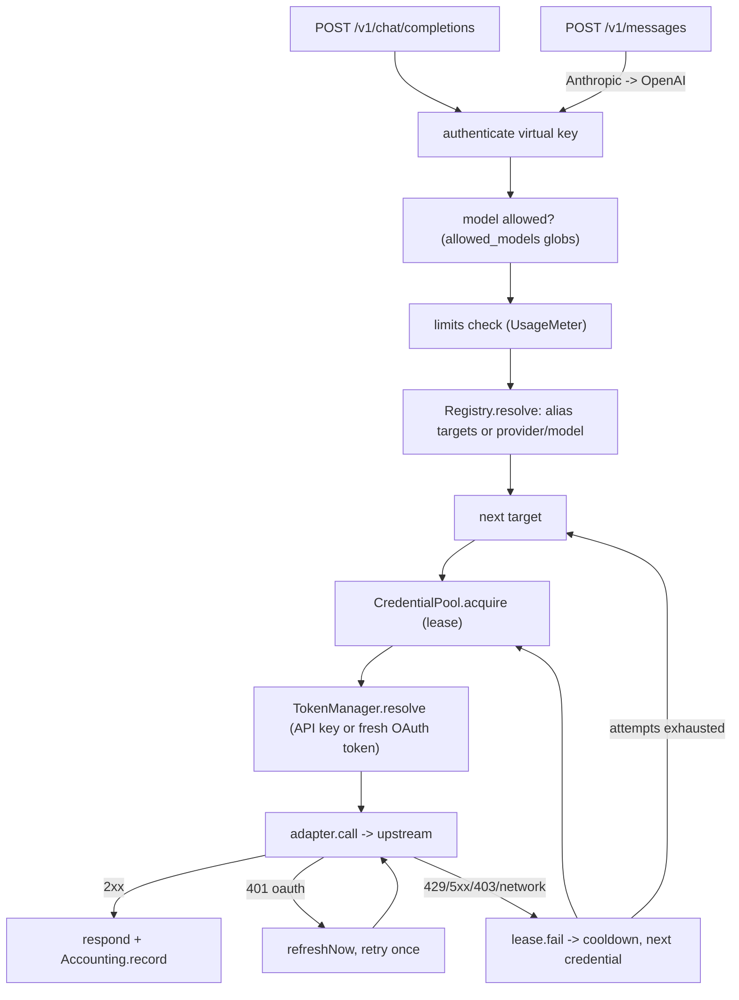

# Request pipeline

Both client endpoints share one pipeline (`createPipeline` in `apps/server/src/gateway/chat.ts`) that speaks canonical OpenAI chat-completions.

## Steps and failure behaviour

1. **Auth**: `Authorization: Bearer sk-pp-…` or `x-api-key`; unknown/disabled/expired -> 401 `invalid_api_key`.
2. **Model allow-list**: 403 `model_not_allowed`.
3. **Limits**: first exceeded limit -> 429 `limit_exceeded` with `resets_at`/`retry_after`.
4. **Route**: aliases expand to ordered targets (later = fallback); `provider/model` addresses one provider; targets whose model is disabled (`disabled_models`) are skipped, so an alias falls back past them; nothing left -> 404 `model_not_found` ("is disabled" when the model exists but is switched off).
5. **Per target**: price lookup (`UNPRICED_MODELS=reject` skips unpriced targets), then up to `max_key_attempts` credentials chosen by the pool, excluding ones already tried. Sticky key = `x-session-id`, `prompt_cache_key` or `user`.
6. **Upstream call** with `UPSTREAM_TIMEOUT_MS` (time to headers) combined with the client abort signal. Streaming adds `stream_options.include_usage`.
7. **Classification** (`classify`): 429 rate-limited, 5xx server error, 403 forbidden, 401 auth; others (400/404/422) are the caller's fault and are returned without retry.
8. **Response**: `x-router-provider` header added; streams are tapped to capture usage and release the lease at the end. A stream without a usage chunk is recorded `aborted`/`no_usage` with 0 tokens.
9. **Exhaustion**: 502 `upstream_error` (last upstream status/message), 422 `model_unpriced`, or 503 `no_available_credential` with `retry_after`.

## `/v1/messages` (Anthropic inbound)

`gateway/messages.ts` translates the Anthropic request to the canonical body, runs the same pipeline against **any** provider type, and translates the result and errors back (`{type:"error",error:{type,message}}`). `top_k` and `thinking` are forwarded as extra fields.

## Error envelope

`HttpError` (`errors.ts`) -> `{ error: { message, type, code, ...extra } }`, shared by gateway and admin API. `app.onError` maps thrown errors via `toErrorResponse`.
