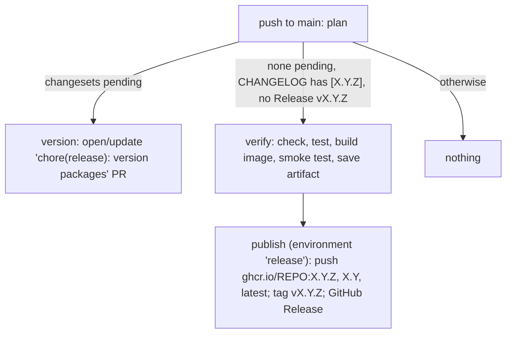

# CI and releases

Mirrors the flow of [slash-editor](https://github.com/buiducnhat/slash-editor) (changesets, a "Version Packages" PR, a gated publish). The difference: nothing goes to npm. The release artifact is the **Docker image** on GHCR plus a GitHub Release.

## CI (`.github/workflows/ci.yml`)

Runs on pushes to and PRs against `main`; jobs are independent and use the pinned Node (`.node-version`) and Bun 1.4.2.

| Job          | Command                                                                         |
| ------------ | ------------------------------------------------------------------------------- |
| Check        | `bunx vp check` (format, lint, type check)                                      |
| Test         | `bunx vp run -r test`                                                           |
| Build        | `bunx vp run -r build`                                                          |
| Docker image | build the `Dockerfile` (gha cache) and run `scripts/smoke-docker.sh` against it |

`scripts/smoke-docker.sh <image>` starts the container with throwaway secrets and requires `/healthz`, the served admin UI, a 401 on `/admin/*` without a token and a 200 with it. Run it locally after `docker build -t pp-ai-router:smoke .`.

Actions are pinned by commit SHA (Dependabot bumps them weekly, together with bun and Docker dependencies).

## Changesets

Every user-facing change adds a changeset: `bunx changeset`, pick `server` and/or `web` (they release in lockstep via `fixed` in `.changeset/config.json`, so one bump moves both) and the bump type: `patch` fixes, `minor` features, `major` breaking changes. No changeset for docs, CI or internal-only changes. `utils` is ignored (starter library, unreleased). Private packages are versioned (`privatePackages.version: true`) but not tagged by changesets; the git tag comes from the release workflow.

The **release version** is the root `package.json` `version`; `server` and `web` carry the same number.

## Releasing (`.github/workflows/release.yml`)

Runs on every push to `main`; the `plan` job picks one mode:

1. While changesets are pending, the workflow opens or updates the Version Packages PR. Its commit is `bun run version-packages` (`scripts/version-packages.ts`): `changeset version` bumps `apps/server` and `apps/web` and writes their CHANGELOGs; the script sets the root version, adds the root `CHANGELOG.md` section from the changesets (edit its wording in the PR) and refreshes `bun.lock`.
2. **Merging that PR is the release.** The push finds a committed version with a changelog section and no GitHub Release, so `verify` runs on the merged commit (the PR itself gets no CI because it is created with `GITHUB_TOKEN`): lockstep version check, `vp check`, tests, image build, smoke test. The tested image is saved as an artifact.
3. `publish` loads that exact image, pushes `X.Y.Z`, `X.Y` and `latest` (a prerelease like `X.Y.Z-rc.1` gets only its exact tag), tags `vX.Y.Z` and creates the GitHub Release from the root changelog section.

A failed publish is retried by re-running the failed job (pushes are idempotent, an existing Release is kept). Never bump versions or push release tags by hand. Preview the Version PR locally with `bun run version-packages` (it edits the working tree; discard afterwards).

The image is `linux/amd64` only.

## One-time repository setup

- Settings → Actions → General: allow GitHub Actions to create and approve pull requests (needed by the Version Packages PR).
- Settings → Environments → create `release`; add required reviewers for a human gate before publishing (optional).
- Package visibility on GHCR (`ghcr.io/pp-techs/pp-ai-router`) is set on the package page after the first push.
- Branch protection on `main`: require the CI jobs; the Version Packages PR does not trigger CI, so use an admin merge or push a trivial commit to its branch if checks are required.
